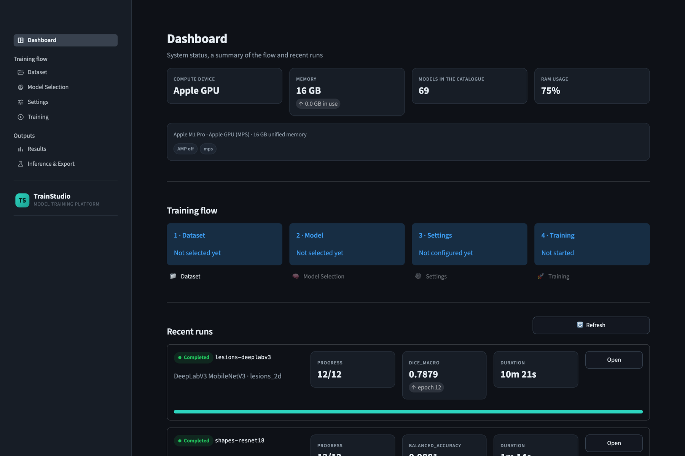
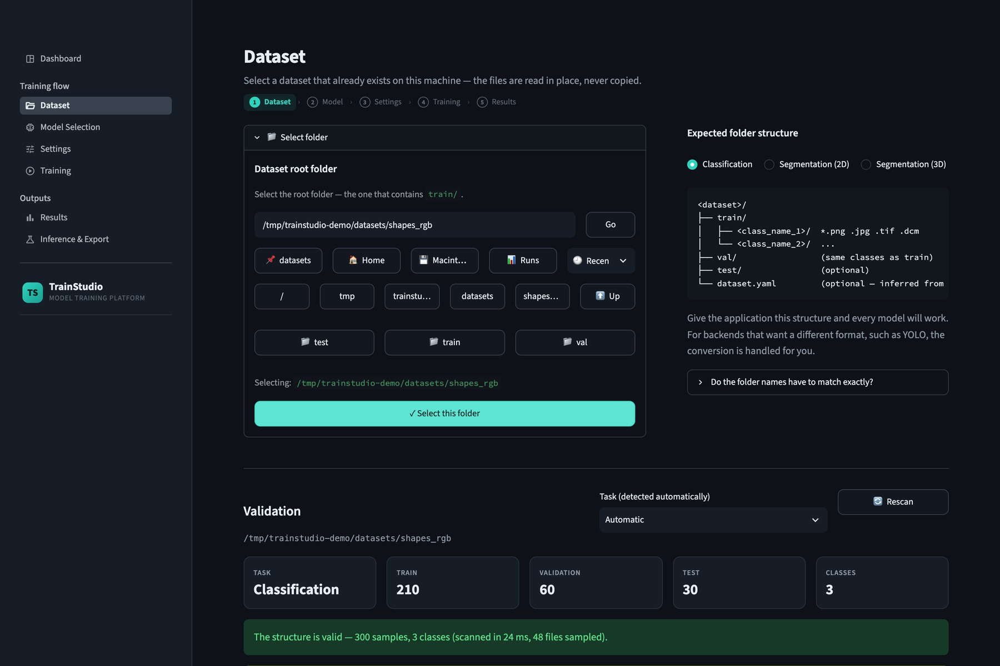
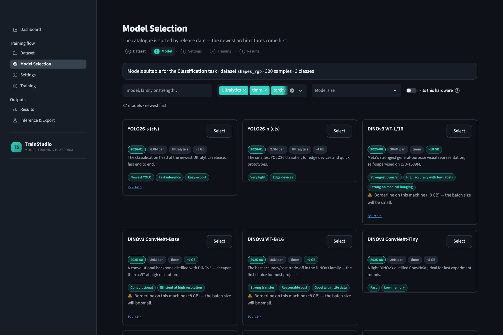
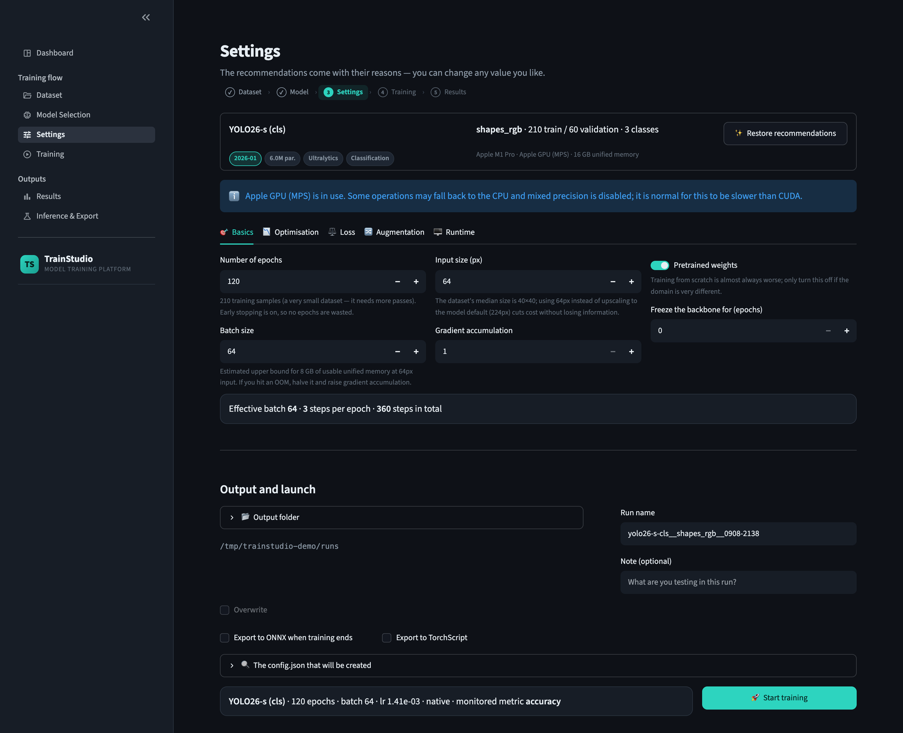
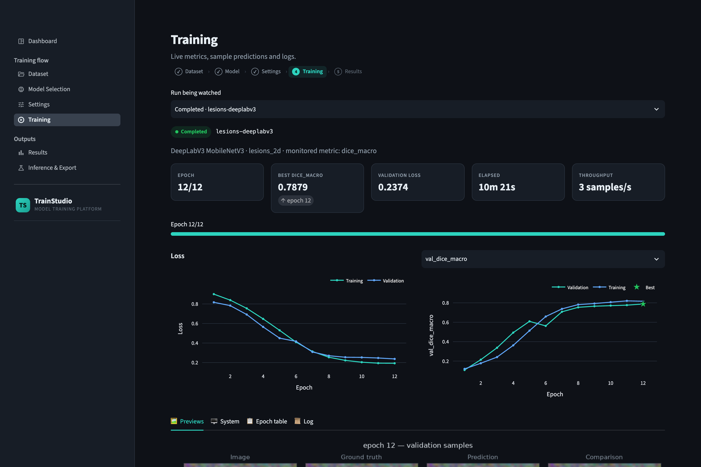
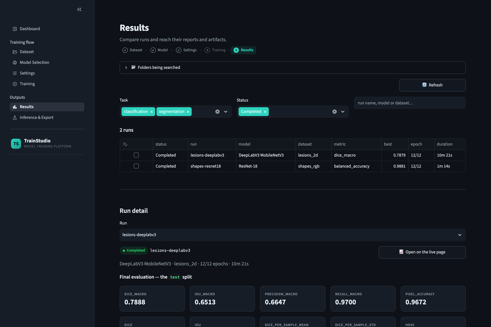
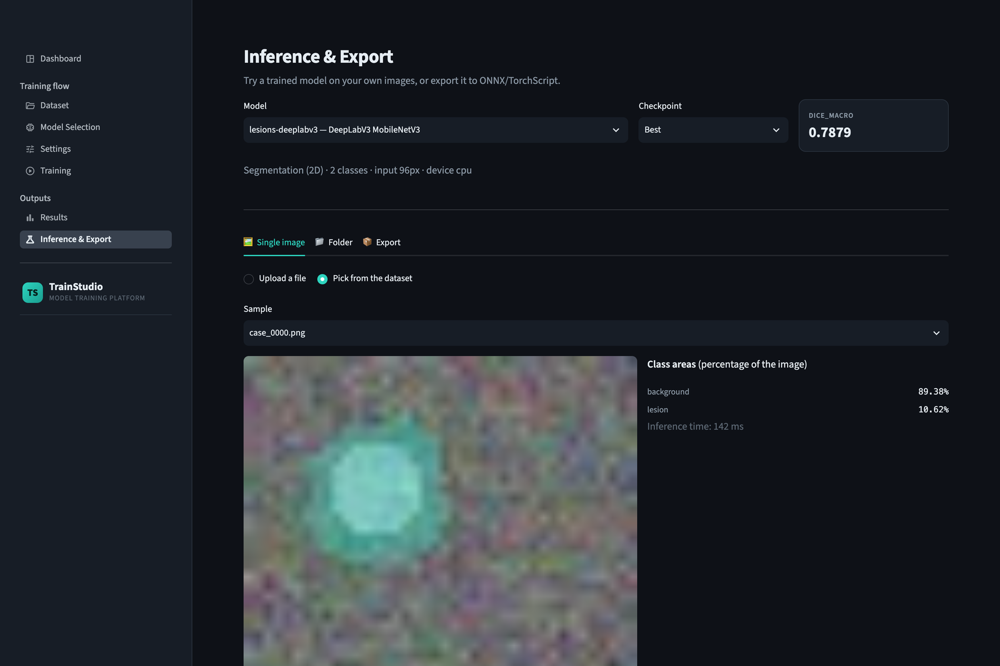
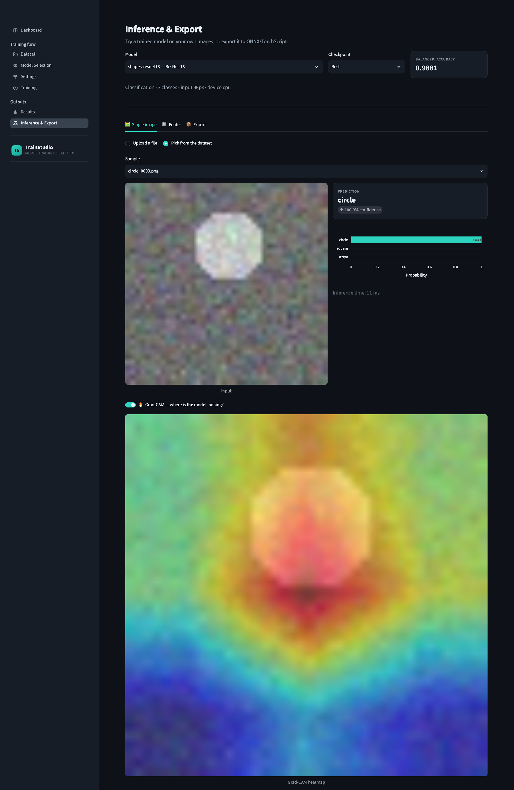

# TrainStudio

A self-hosted platform for training image **classification** and **segmentation** models
end to end — from picking a folder on your own machine to a trained checkpoint, a metrics
report and an ONNX export. Built for medical and scientific imaging: it reads DICOM and
NIfTI as well as PNG/JPEG/TIFF, understands CT windowing, and never copies or uploads your
data.

```
Dataset  →  Model Selection  →  Settings  →  Training  →  Results  →  Inference
```

Training runs as a **separate operating-system process**, so a run survives closing the
browser, can be watched from several tabs at once, and is never disturbed by the web
framework re-rendering a page.



---

## Contents

- [What you get](#what-you-get)
- [Requirements](#requirements)
- [Installation A — Docker (recommended)](#installation-a--docker-recommended)
  - [1. Install Docker and Compose](#1-install-docker-and-compose)
  - [2. Install the NVIDIA driver](#2-install-the-nvidia-driver)
  - [3. Install the NVIDIA Container Toolkit](#3-install-the-nvidia-container-toolkit)
  - [4. Get the code](#4-get-the-code)
  - [5. Write your .env](#5-write-your-env)
  - [6. Pick the CUDA build](#6-pick-the-cuda-build)
  - [7. Build the image](#7-build-the-image)
  - [8. Start it](#8-start-it)
  - [9. Verify the GPU](#9-verify-the-gpu)
  - [10. Open it](#10-open-it)
- [Installation B — local, without Docker](#installation-b--local-without-docker)
- [Configuration reference](#configuration-reference)
- [How paths work](#how-paths-work)
- [Remote access and authentication](#remote-access-and-authentication)
- [Dataset layout](#dataset-layout)
- [Using it, step by step](#using-it-step-by-step)
- [Model catalogue](#model-catalogue)
- [The recommendation engine](#the-recommendation-engine)
- [Architecture](#architecture)
- [What a run produces](#what-a-run-produces)
- [Command line, without the interface](#command-line-without-the-interface)
- [Testing](#testing)
- [Troubleshooting](#troubleshooting)
- [Project layout](#project-layout)

---

## What you get

| | |
|---|---|
| **69 curated models** | timm, torchvision, segmentation-models-pytorch, HuggingFace transformers, Ultralytics and MONAI — one catalogue, sorted newest first |
| **Your data stays put** | The dataset is read in place from a path you pick. Nothing is uploaded, moved or changed — a standardised copy is written only when you ask for one |
| **Medical imaging first** | DICOM series, NIfTI volumes, HU windowing with presets, modality-aware augmentation |
| **Hyperparameters with reasons** | Every value is suggested from your dataset statistics and your GPU, and the reason is shown next to the field |
| **Live training** | Loss curves, per-class metrics, sample previews and the raw process log, updated while the run continues |
| **Reports you can hand over** | A single self-contained `report.html`, plus CSV/XLSX metrics, confusion matrices, ROC/PR curves |
| **Inference and export** | Single-image and batch prediction, Grad-CAM, ONNX and TorchScript export |
| **Runs anywhere** | One NVIDIA GPU, Apple Silicon (MPS) or plain CPU — detected automatically |

---

## Requirements

**Hardware**

| | Minimum | Comfortable |
|---|---|---|
| GPU | none (CPU works, slowly) | one NVIDIA card, 8 GB VRAM |
| RAM | 8 GB | 32 GB or more |
| Disk | 20 GB for the image and weight caches | plus room for checkpoints (a few GB per run) |

3D segmentation is the memory-hungry case: 16 GB of VRAM is a realistic floor for
Swin UNETR or UNETR at a 96³ patch size.

**Software**

- **Docker route:** Docker Engine 24+, Docker Compose v2, and — for GPU training — an
  NVIDIA driver plus the NVIDIA Container Toolkit. Linux is the tested host.
- **Local route:** Python **3.11**. Not 3.12 or 3.13: MONAI and SimpleITK still lack
  wheels for the newest versions.

---

## Installation A — Docker (recommended)

This is the intended way to run TrainStudio on a workstation. Every step below includes
the check that tells you it worked, so you never move on with a broken layer underneath.

### 1. Install Docker and Compose

On Ubuntu/Debian:

```bash
curl -fsSL https://get.docker.com | sh
sudo usermod -aG docker "$USER"     # so you don't need sudo for docker
newgrp docker                       # or log out and back in
```

Check:

```bash
docker --version                    # Docker version 24.x or newer
docker compose version              # Docker Compose version v2.x
docker run --rm hello-world         # prints "Hello from Docker!"
```

If `docker` needs `sudo` after this, your group membership has not been picked up yet —
log out and back in.

### 2. Install the NVIDIA driver

Skip this section entirely if you are training on CPU or Apple Silicon.

```bash
nvidia-smi
```

If that prints a table with your GPU and a driver version, you are done. If the command
is missing, install the driver:

```bash
sudo ubuntu-drivers install          # Ubuntu's recommended driver
sudo reboot
```

Note the **driver version** in the `nvidia-smi` header — step 6 depends on it.

### 3. Install the NVIDIA Container Toolkit

This is what lets a container see the GPU. Installing Docker alone is not enough, and
this is the single most common reason a first run fails.

```bash
curl -fsSL https://nvidia.github.io/libnvidia-container/gpgkey \
  | sudo gpg --dearmor -o /usr/share/keyrings/nvidia-container-toolkit-keyring.gpg
curl -s -L https://nvidia.github.io/libnvidia-container/stable/deb/nvidia-container-toolkit.list \
  | sed 's#deb https://#deb [signed-by=/usr/share/keyrings/nvidia-container-toolkit-keyring.gpg] https://#g' \
  | sudo tee /etc/apt/sources.list.d/nvidia-container-toolkit.list
sudo apt-get update
sudo apt-get install -y nvidia-container-toolkit
sudo nvidia-ctk runtime configure --runtime=docker
sudo systemctl restart docker
```

Check — this must print the same table as `nvidia-smi` on the host:

```bash
docker run --rm --gpus all nvidia/cuda:12.4.1-base-ubuntu22.04 nvidia-smi
```

The
[official installation guide](https://docs.nvidia.com/datacenter/cloud-native/container-toolkit/latest/)
covers other distributions.

### 4. Get the code

```bash
git clone <this-repository-url> trainstudio
cd trainstudio
```

### 5. Write your `.env`

`.env` is where every machine-specific choice lives. It is **gitignored** and excluded
from the Docker build context, so it never leaves your machine.

```bash
cp .env.example .env
```

Now edit it. These are the entries you must get right before the first start:

```ini
# Your real home directory. Becomes $HOME inside the container, so the folder
# picker's Home and Desktop shortcuts land where you expect.
HOST_HOME=/home/<your-user>

# Where checkpoints and reports are written. Put it on the disk with space:
# one segmentation run with save_last can be several GB.
RUNS_DIR=/data/trainstudio-runs

# So outputs are owned by you and not by root. Read them off your own account.
PUID=1000
PGID=1000

# Broad roots to expose to the container. Anything under these is browsable;
# anything outside them is invisible to the app. See "How paths work" below.
HOME_MOUNT=/home
MNT_MOUNT=/mnt
MEDIA_MOUNT=/media
```

Get `PUID`/`PGID` from your own account — do not assume 1000:

```bash
id -u ; id -g
```

Make sure `RUNS_DIR` exists and you can write to it, and that it sits **under one of the
mounted roots** above — otherwise the outputs are written inside the container and lost
when it is recreated:

```bash
mkdir -p /data/trainstudio-runs
touch /data/trainstudio-runs/.write-test && rm /data/trainstudio-runs/.write-test
```

Every remaining variable is documented in [Configuration reference](#configuration-reference).

### 6. Pick the CUDA build

The defaults target **CUDA 12.4, which needs NVIDIA driver 550 or newer**. Compare that
with the driver version from step 2 and adjust `.env` if needed:

| Your driver | Set in `.env` |
|---|---|
| 550 or newer | leave the defaults (cu124) |
| 530–549 | `CUDA_IMAGE=nvidia/cuda:12.1.1-cudnn8-runtime-ubuntu22.04` and `TORCH_INDEX_URL=https://download.pytorch.org/whl/cu121` |
| Blackwell card (RTX 50xx) | `TORCH_INDEX_URL=https://download.pytorch.org/whl/cu128`, `TORCH_VERSION=2.7.0`, `TORCHVISION_VERSION=0.22.0` |
| No GPU at all | `TORCH_INDEX_URL=https://pypi.org/simple` and remove the `deploy:` block from `docker-compose.yml` |

`TORCH_VERSION` and `TORCHVISION_VERSION` must always be a **matching pair** — 2.5.1 ↔
0.20.1, 2.6 ↔ 0.21, 2.7 ↔ 0.22. A mismatch fails at import time with an ABI error, not
at install time, so it is worth checking twice.

### 7. Build the image

```bash
docker compose build
```

This downloads a CUDA base image and compiles the Python dependency tree — expect
10–25 minutes and several GB on a first build. Subsequent builds reuse the cache.

Check:

```bash
docker images | grep trainstudio
```

### 8. Start it

```bash
docker compose up -d        # or: make up
docker compose logs -f      # or: make logs — Ctrl-C to stop watching
```

The entrypoint checks its own configuration at startup and says so in the log. Read
those lines; they name the fix:

```
[entrypoint] setting the trainstudio user to UID 1000
[entrypoint] starting as trainstudio (1000:1000): streamlit run app.py
```

A `WARNING` about `HOME` or `RUNS_DIR` means `HOST_HOME` or `RUNS_DIR` in `.env` points
somewhere the app user cannot read or write. Fix it, then:

```bash
docker compose up -d --force-recreate
```

Mounts and environment variables are fixed when a container is created, so `restart` is
not enough after changing them.

### 9. Verify the GPU

Before the first real run, confirm the GPU reaches *inside* the container:

```bash
make gpu-check
```

```
torch 2.5.1 · cuda 12.4
available: True
NVIDIA <your card> · 48 GB VRAM
```

`available: False` means step 3 did not take effect — the container is running without
the NVIDIA runtime. Re-run the check at the end of step 3 before going further.

### 10. Open it

```
http://localhost:8501
```

That port is bound to `127.0.0.1` and has **no authentication**. To reach it from
another machine, see [Remote access and authentication](#remote-access-and-authentication)
— do not simply open the port.

`make help` lists the rest of the shortcuts:

```
build          Build the image
up             Start in the background
down           Stop and remove the containers
restart        Restart the application
logs           Follow the logs
shell          Open a shell inside the running container
gpu-check      Verify that the GPU is visible from inside the container
dummy-data     Generate synthetic datasets
proxy-up       Start with the basic-auth reverse proxy in front
```

---

## Installation B — local, without Docker

Useful for development, for a machine without Docker, and on Apple Silicon.

```bash
# 1. Python 3.11 — check first
python3.11 --version

# 2. An isolated environment
python3.11 -m venv .venv
source .venv/bin/activate          # Windows: .venv\Scripts\activate

# 3. PyTorch first, matched to your hardware
#    NVIDIA (CUDA 12.4):
pip install torch==2.5.1 torchvision==0.20.1 --index-url https://download.pytorch.org/whl/cu124
#    Apple Silicon or CPU:
pip install torch torchvision

# 4. Everything else
pip install -r requirements.txt

# 5. Run
streamlit run app.py
```

Conda works too, and pins Python for you:

```bash
conda env create -f environment.yml
conda activate trainui
streamlit run app.py
```

Check that the pieces are in place:

```bash
python -c "import torch; print(torch.__version__, torch.cuda.is_available())"
python -c "from core.hardware import detect, missing_packages; \
           print(detect().label); print('missing:', missing_packages())"
```

`missing_packages()` must print an empty list. The Dashboard shows the same information
and refuses to start training while anything required is absent.

The compute device is chosen automatically: CUDA where available, MPS on Apple Silicon,
otherwise CPU. There is nothing to configure.

---

## Configuration reference

Every variable in `.env`, and what happens if you get it wrong.

### Paths

| Variable | Default | What it does |
|---|---|---|
| `HOME_MOUNT` | `/home` | Host directory mounted at the same path. Covers every user home |
| `MNT_MOUNT` | `/mnt` | Extra disks and NAS shares |
| `MEDIA_MOUNT` | `/media` | Removable and secondary drives — where a large data disk usually is |
| `HOST_HOME` | container-internal | Your real home. Becomes `$HOME` inside the container; drives the picker's Home/Desktop buttons |
| `RUNS_DIR` | container-internal | Default output directory for new runs. **Must be under a mounted root** or results are lost on recreate |
| `QUICK_DIRS` | empty | Colon-separated extra shortcut buttons in the picker, e.g. `/mnt/nas/datasets:/data/projects` |

### Ownership and locale

| Variable | Default | What it does |
|---|---|---|
| `PUID` / `PGID` | `1000` | The uid/gid files are written as. Wrong values leave checkpoints owned by `root` |
| `TZ` | `UTC` | Container time zone, so log timestamps match yours |

### Network

| Variable | Default | What it does |
|---|---|---|
| `BIND_ADDRESS` | `127.0.0.1` | Host interface the unauthenticated port is published on. This is the setting that decides remote reachability |
| `HOST_PORT` | `8501` | Host port for the app |
| `PUBLIC_HOSTNAME` | `localhost` | The address remote browsers type. Affects the URL logged at startup and absolute links, not reachability |
| `MAX_UPLOAD_MB` | `2048` | Upload limit for single-image inference |
| `COMPOSE_PROFILES` | empty | Set to `proxy` to start the authenticated proxy alongside the app |
| `PROXY_PORT` | `8080` | Host port for the proxy — this is the one to expose |
| `BASIC_AUTH_USER` | `team` | Proxy username |
| `BASIC_AUTH_HASH` | empty | bcrypt hash of the proxy password. **Use `scripts/set_proxy_password.sh`** — see the warning below |

### Compute

| Variable | Default | What it does |
|---|---|---|
| `GPU_COUNT` | `1` | How many GPUs to reserve: a number, or `all`. To pin a specific card, edit `devices:` in `docker-compose.yml` to `device_ids: ["1"]` |
| `SHM_SIZE` | `16gb` | Shared memory for DataLoader workers. Docker's 64 MB default surfaces as an opaque "bus error" mid-epoch |
| `OMP_NUM_THREADS` / `MKL_NUM_THREADS` | `8` | BLAS threads. Keeping these below your core count leaves room for the data pipeline |

### Build

| Variable | Default | What it does |
|---|---|---|
| `CUDA_IMAGE` | `nvidia/cuda:12.4.1-cudnn-runtime-ubuntu22.04` | Base image; must match your driver |
| `TORCH_INDEX_URL` | cu124 wheel index | Where PyTorch comes from |
| `TORCH_VERSION` / `TORCHVISION_VERSION` | `2.5.1` / `0.20.1` | Must be a matching pair |
| `TAG` | `latest` | Image tag |

---

## How paths work

Host directories are mounted at the **same path inside the container**. This is
deliberate: a path that works in your terminal resolves identically inside the container,
so the folder picker browses your real filesystem, datasets can live anywhere, and moving
one later needs no configuration change.

| Mount | Purpose |
|---|---|
| `${HOME_MOUNT}` → same path | Every user home, so `~/Desktop/whatever` just works |
| `${MNT_MOUNT}` → same path | Extra disks, NAS shares, external drives |
| `${MEDIA_MOUNT}` → same path | Removable and secondary drives |
| `trainstudio-cache` → `/cache` | Pretrained weights downloaded from timm/HF/Ultralytics |
| `trainstudio-home` → `/opt/trainstudio-state` | Preferences and the YOLO conversion cache |

To expose another location, add a line to `volumes:` in `docker-compose.yml` — always
`<host path>:<the same host path>`:

```yaml
      - /srv/datasets:/srv/datasets
```

Then recreate the container (`docker compose up -d --force-recreate`); mounts are bound at
creation time.

Mounting a host directory at a *different* container path (`/data`, say) would break that
identity and pin you to one location, so don't.

**The tradeoff, stated plainly:** the container can read and write everything under the
mounted roots, as your user. On a single-user workstation running your own application
that is the right call, but it is a real relaxation of container isolation. If a dataset
must stay out of reach, do not mount its parent.

---

## Remote access and authentication

Streamlit has no authentication of its own, and this application's folder picker can read
every mounted path on the host. So the plain port is bound to `127.0.0.1` and the right
way to share it is the bundled Caddy reverse proxy, which puts a username and password in
front.

```bash
./scripts/set_proxy_password.sh          # prompts for a username and a password
```

Then enable the proxy. Either set `COMPOSE_PROFILES=proxy` in `.env` so a plain
`docker compose up -d` starts both:

```bash
docker compose up -d
```

or start it explicitly:

```bash
docker compose --profile proxy up -d     # or: make proxy-up
```

The app is then at `http://<workstation>:8080`, behind a login, while port 8501 — the one
without authentication — stays on loopback. Also set `PUBLIC_HOSTNAME` in `.env` to the
address people type.

> **Do not paste a bcrypt hash into `.env` by hand.**
> Compose interpolates `$`-sequences when it reads `.env`, and a bcrypt hash is full of
> them. Pasted verbatim, `$2y$12$eNxx…` reaches Caddy as `$2y$12…` — still a
> plausible-looking string, so nothing errors anywhere. The proxy starts, shows the login
> box, and rejects every password with no clue in any log. Each `$` has to be written
> **doubled** (`$$2y$$12$$eNxx…`), which Compose collapses back to one.
> `scripts/set_proxy_password.sh` does this for you.

To expose port 8501 directly instead — accepting that it has no login — two settings must
change together:

```ini
BIND_ADDRESS=0.0.0.0            # publish on every interface
PUBLIC_HOSTNAME=10.0.0.5        # the address remote browsers type
```

`BIND_ADDRESS` is the one that decides reachability. Left at `127.0.0.1`, the port answers
`connection refused` from every other machine while working perfectly on `localhost`. The
entrypoint prints a reminder in `docker compose logs` when the port is open without
authentication.

Neither route is encrypted. Over an untrusted network, terminate TLS in front of the proxy
or reach the machine through a VPN.

Runs survive a browser close and can be watched from several tabs at once, so a whole team
can follow the same training run.

---

## Dataset layout

The application expects **one layout**. Conversions for backends that want something else
(YOLO's polygon labels, for example) happen automatically, in a cache, and your dataset is
never modified.

**Classification** — one folder per class:

```
dataset/
├── train/<class_name>/*.png|jpg|tif|dcm
├── val/<class_name>/...
└── test/<class_name>/...              (optional)
```

**Segmentation (2D)** — mask file names match their image:

```
dataset/
├── train/images/case_001.png
├── train/masks/case_001.png           ← uint8 index mask, 0 = background
├── val/images/   val/masks/
└── test/...                           (optional)
```

**Segmentation (3D)** — NIfTI, MetaImage or NRRD volumes:

```
dataset/
├── train/images/case_001.nii.gz
├── train/labels/case_001.nii.gz
└── val/images/   val/labels/
```

### Folder names do not have to match exactly

The layouts above describe the *shape*, not a spelling test. Names are matched
case-insensitively, ignoring punctuation, and against a list of aliases, so a dataset from
somewhere else does not have to be renamed first:

| Canonical | Also accepted |
|---|---|
| `train/` | `Train/`, `training/`, `trainset/`, `train_set/`, `tr/` |
| `val/` | `valid/`, `validation/`, `dev/`, `eval/`, `valset/` |
| `test/` | `testing/`, `testset/`, `holdout/` |
| `images/` | `image/`, `imgs/`, `img/`, `scans/`, `volumes/` |
| `masks/` `labels/` | `annotations/`, `gt/`, `ground_truth/`, `segmentations/`, `seg/`, `targets/` |

The transposed order used by YOLO exports — `images/train/` and `labels/train/` instead of
`train/images/` and `train/masks/` — is recognised as well.

### Only a train folder?

If just `train/` exists, the app offers a **stratified automatic split**. No files are
copied: a `splits.json` is written at the dataset root and training reads from it.

### Images of different sizes?

Training resizes every image to one square input, which stretches any image whose shape
differs. The **🔬 Analysis** tab on the Dataset page can write a copy in which every image
has the same size instead — next to the original, which is left exactly as it is:

| Method | What it does |
|---|---|
| Letterbox (default) | Scales the long side to the size and pads the short side — proportions are kept |
| Resize | Stretches to the square, once, instead of on every epoch |
| Centre crop | Scales the short side to the size and cuts the centre square out |

The copy mirrors the original file for file, so `splits.json` and `dataset.yaml` carry over,
and it is selected automatically (one click goes back). Images keep their bit depth and
channels; masks are resized with nearest-neighbour, and letterbox padding in a mask gets the
ignore index, so the loss does not count it as background — unless 255 is itself a label
(0/255 masks), in which case it is padded with 0. DICOM and 3D volumes are not rewritten.

### dataset.yaml (optional)

Makes the class names, modality and windowing permanent. It can be written from the UI in
one click:

```yaml
task: segmentation          # classification | segmentation | segmentation3d
modality: ct                # rgb | grayscale | ct | mr
classes: [background, lesion]
ignore_index: 255
window: {center: 40, width: 400}   # CT windowing, in HU
```

### Checking a dataset from the command line

The quickest way to tell a layout problem apart from a permission problem:

```bash
python scripts/check_dataset.py /path/to/my_dataset
```

It prints how your path was interpreted, whether it is readable, the resolved layout, the
detected task, split and class counts, and every issue the Dataset page would show. Exit
status is `0` when the dataset is usable, so it also works as a check in a script.
`--analyze` adds the detailed analysis described under step 1 below.

### Synthetic data to try it out

```bash
python scripts/make_dummy_dataset.py --out /tmp/ts_data --kinds cls seg dicom seg3d
# or: make dummy-data
```

Produces all four layouts: RGB classification, 2D segmentation, CT DICOM on the HU scale,
and NIfTI volumes.

---

## Using it, step by step

### 1 · Dataset

Type or browse to the folder that contains `train/`. The path is read in place — nothing
is uploaded. Pasted paths are cleaned before use, so quotes, a trailing newline, a
`file://` URI from your file manager, `~` and `$VARS` all work.



The scan reports the detected task, the split and class counts, the class distribution and
the imbalance ratio, the median image size, and — for segmentation — the label values
found and the mean foreground ratio. On CT data the modality is detected and a windowing
preset (Soft tissue, Lung, Bone, Brain, Liver, Mediastinum, Angio) can be applied and then
overridden by hand. The Preview tab shows real samples with the mask overlaid, which is
the fastest way to confirm the reading and windowing are right.

If the structure is not recognised, the page names the missing piece rather than saying
"invalid" — and if you picked a folder that *contains* datasets, it offers them as
one-click buttons.

The **🔬 Analysis** tab goes further than the quick scan: it reads every image header and
samples pixels to report the size distribution and aspect ratios, how many images are
smaller than common model inputs, mixed grayscale/colour/alpha images, 16-bit images, mixed
file formats, unreadable files, byte-identical images — flagged as leakage when one sits in
two splits — near-uniform images, per-channel mean and standard deviation, and for
segmentation, masks whose size differs from their image, empty masks and the share of pixels
per label. Each finding says what to do about it, and mixed sizes can be
[standardised](#images-of-different-sizes) from there.

### 2 · Model Selection



The catalogue is sorted newest first, and filters by text, library, size class and
available VRAM. Each card carries the release date, parameter count, library, a
one-sentence description and its strengths. Models that do not fit the detected VRAM
budget are marked. For 2D segmentation, the architecture and its backbone are chosen
independently. For classification you can also pick any model by name straight from timm
(~1000 pretrained) or torchvision.

### 3 · Settings



Every hyperparameter arrives with a suggested value **and the reason for it**, taken from
your dataset statistics and your hardware. Anything you change by hand is remembered and
never overwritten by a later suggestion. Optimizer, schedule, loss, augmentation,
mixed precision, EMA, gradient accumulation, early stopping and the monitored metric are
all here, and the exact `config.json` that will be written can be inspected before you
start.

**Regularisation & stability** holds dropout, stochastic depth (drop path), the EMA of the
weights and its decay, gradient clipping and layer-wise learning-rate decay. Each model offers
only what its library can apply — a ResNet has no dropout setting, Ultralytics keeps its own
EMA — and starts from that library's own default for the architecture, so leaving a field
alone trains exactly the model it always did.

**💾 Save preset** stores the current settings under a name; **📂 Load preset** lays a saved
preset, or any past run's configuration, over another model's settings. The training recipe —
epochs, optimizer, schedule, loss, regularisation, augmentation — always comes along; the
values chosen for one architecture (batch size, learning rate, input size, encoder) only when
you tick the box, and those chosen for one machine (AMP, workers) never. Whatever was left out
is listed with the reason. Presets live in `~/.trainstudio/presets/` (`TRAINSTUDIO_HOME`).

### 4 · Training



Loss and metric curves, per-epoch tables, validation previews, GPU and system utilisation,
and the raw process output — all updated while the run continues. Closing the browser does
not affect anything. **Stop** asks the trainer to finish cleanly and save `last.pt`.

### 5 · Results



Every run found in your output folders, filterable by task and status. Tick two or more to
compare their curves on one axis and download the comparison as CSV, or delete every ticked
run at once. A single run can also be deleted from its row on the Dashboard or from the
Training page once it has ended; a run that is still training cannot be deleted until it is
stopped. Per-run: the full
metric set, per-class tables, plots, and every artifact as a download — including the
self-contained `report.html`.

### 6 · Inference and export

Load any run's checkpoint and predict on an uploaded image, on a sample from the dataset,
or over a whole folder in batch. Segmentation shows the mask overlaid, with the area each
class covers:



Classification shows the class probabilities, and **Grad-CAM** answers where the model was
actually looking:



Export to ONNX or TorchScript in one click.

---

## Model catalogue

| Task | Library | Models |
|---|---|---|
| Classification | `timm` | DINOv3 (ViT-L/B/S, ConvNeXt), MobileNetV4, Hiera, FastViT, EVA-02, ConvNeXt V2, MaxViT, Swin V2, EfficientNetV2, ViT, RegNet, DenseNet-121, ResNet-50/101/152 |
| Classification | `torchvision` | ConvNeXt (Base/Tiny), Swin V2 (Base/Tiny), ViT-B/16, EfficientNetV2-S, RegNet-Y 8GF, ResNet-50/18, MobileNetV3 Large |
| Classification | `ultralytics` | YOLO26-cls, YOLO11-cls, YOLOv8-cls |
| Segmentation 2D | `smp` | U-Net, U-Net++, MA-Net, LinkNet, FPN, PSPNet, PAN, DeepLabV3(+), UPerNet, SegFormer, DPT — **each pairable with any timm backbone** |
| Segmentation 2D | `torchvision` | DeepLabV3 (ResNet-101/50, MobileNetV3), FCN ResNet-50, LR-ASPP MobileNetV3 |
| Segmentation 2D | `transformers` | Mask2Former, SegFormer |
| Segmentation 2D | `ultralytics` | YOLO26-seg (instance), YOLO26-sem (semantic), YOLO11-seg, YOLOv8-seg |
| Segmentation 3D | `monai` | Swin UNETR, UNETR, SegResNet, DynUNet, Attention U-Net, U-Net 3D, V-Net |

`torchvision` is included for two reasons: it is the reference implementation most
published numbers are measured against, and it costs no extra dependency, since it is
installed alongside PyTorch regardless. Its pretrained classifiers arrive with a
1000-class ImageNet head, which is replaced with one sized for your dataset; its
segmentation models are built with an ImageNet-pretrained encoder and a fresh head. On a
grayscale or CT dataset the first convolution is adapted from 3 channels to 1 by summing
the RGB filters, so the pretrained features are kept rather than discarded.

---

## The recommendation engine

Once a dataset and a model are chosen, every hyperparameter gets a value **and a reason**,
shown under the field. The rules are deterministic, not learned:

- **Batch size** — from the available memory, using a per-sample cost calibrated against
  measured reference points (ResNet-50 @224 ≈ 0.12 GB/sample, U-Net @512 ≈ 1.2 GB/sample).
- **Learning rate** — the architecture family's baseline from the literature, scaled by
  batch size: linearly for SGD, by square root for adaptive optimizers.
- **Loss** — from the class imbalance ratio in classification and the mask sparsity in
  segmentation (balanced CE → focal; Dice+CE → Dice+focal).
- **Augmentation** — modality aware. On CT/MR the vertical flip and colour jitter are
  switched off and replaced with intensity (HU) jitter and elastic deformation.

---

## Architecture

Training **does not run inside the web process**. The interface writes a `config.json` and
launches `runner.py` as a separate OS process:

```
Streamlit  ──writes──>  <run_dir>/config.json
     │
     └──Popen──>  python runner.py --config <run_dir>/config.json
                        ├──append──> events.jsonl   (one JSON event per line)
                        ├──atomic──> state.json     (status, PID, latest epoch)
                        └──writes──> checkpoints/ plots/ metrics/ report.html
     ▲
     └── a 2-second fragment reads events.jsonl from its last byte offset
```

The consequences are the point: training continues when the browser is closed, the same
run can be watched from several tabs, and the framework re-rendering a page never touches
the run.

**Stopping** is a `<run_dir>/STOP` file. The trainer notices it between batches, saves
`last.pt` and exits cleanly.

---

## What a run produces

```
<output_dir>/<run_name>/
├── config.json  env.json  state.json  events.jsonl  train.log
├── checkpoints/   best.pt  last.pt
├── metrics/       metrics.csv  metrics.xlsx  summary.json  per_class.csv
├── plots/         loss_curve.png  confusion_matrix.png  roc.png  pr.png …
├── previews/      ep_0001.png …            (validation samples)
├── predictions/   test_predictions.csv
├── exports/       model.onnx  model.torchscript
└── report.html                              (single file, self-contained)
```

**Classification** reports accuracy, balanced accuracy, macro F1, AUROC, AUPRC, Cohen's
kappa and calibration error (ECE), with a bootstrap 95% confidence interval on the test
set. **Segmentation** reports per-class Dice and IoU, HD95, ASSD, boundary F1 and volume
similarity.

---

## Command line, without the interface

`runner.py` has no dependency on the UI, so the same `config.json` reproduces the same run
on a server or in CI:

```bash
python runner.py --config /path/to/runs/experiment-01/config.json

# or inside the container:
docker compose exec trainstudio python runner.py --config /path/to/config.json
```

Exit codes: `0` completed · `1` error · `2` stopped by the user.

---

## Testing

The pages are driven headlessly through `streamlit.testing.v1.AppTest`: the tests click
the real buttons, type into the real text boxes and assert on what each page renders.

```bash
python tests/ui/run_all.py              # builds fixtures if needed, runs everything
python tests/ui/run_all.py t1 t2        # only the folder picker and layout detection
python tests/ui/run_all.py --rebuild    # regenerate the fixtures first
python tests/ui/fixtures.py --clean     # delete them again
```

The fixtures are synthetic: two generated datasets, every layout/naming/failure variant
derived from them, and two short training runs so the Results and Inference pages have
something real to load. They live in `.ui-fixtures/` (gitignored, around 200 MB) and no
real dataset is read. The first run trains those two models, so allow a few minutes.

| Part | Covers |
|---|---|
| `t1` | Typed paths: quotes, `file://` URIs, `~`, `$VARS`, escaped spaces, `..`, missing paths, a file instead of a folder, unreadable folders |
| `t2` | Canonical, alias-named, capitalised, `Ground Truth`, transposed-YOLO, 3D and DICOM layouts; empty, flat, parent-of-datasets, missing-mask and single-class failures; the automatic split |
| `t3` | Modality detection, CT window presets and manual override, per-dataset class-name editor, `dataset.yaml` round-trip, Continue, Rescan |
| `t4` | Which libraries each task offers, catalogue filters, the out-of-catalogue picker, per-backend Settings, 3D and Ultralytics paths, `splits.json` |
| `t5` | Every page inside `st.navigation`, the empty-state guards, one full Dataset → Model → Settings walk-through |
| `t6` | Real predictions, Grad-CAM, TorchScript export, run comparison, finished-run panels |
| `t7` | Deleting runs (and refusing a live one), regularisation fields per backend, presets across models and tasks, the detailed analysis and standardising — on copies, with a temporary `TRAINSTUDIO_HOME` |

Two things AppTest cannot reach, checked a level lower instead: `st.data_editor` (the
run-comparison checkboxes — the comparison functions are called directly) and the
navigation a page performs itself with `st.switch_page`, which the harness does not carry
into the reruns that follow it.

---

## Troubleshooting

| Symptom | Cause and fix |
|---|---|
| `make gpu-check` says `available: False` | The NVIDIA Container Toolkit is missing or Docker was not restarted after configuring it. Redo [step 3](#3-install-the-nvidia-container-toolkit) and re-run its verification command |
| Build fails downloading PyTorch | `TORCH_INDEX_URL` does not match `TORCH_VERSION`, or the version pair is invalid. See [step 6](#6-pick-the-cuda-build) |
| Import error mentioning an ABI or symbol at startup | `TORCH_VERSION` and `TORCHVISION_VERSION` are not a matching pair |
| Checkpoints owned by `root` | `PUID`/`PGID` do not match your account. Set them from `id -u` / `id -g`, then `docker compose up -d --force-recreate` |
| `PermissionError` mentioning `/root` | `HOST_HOME` is unset, so `$HOME` pointed at a directory the app user cannot read. Set `HOST_HOME` and `RUNS_DIR`, then force-recreate. The entrypoint warns about this at startup — check `docker compose logs` |
| `Connection refused` from another machine, but `localhost:8501` works | The port is published on loopback only. Use the authenticated proxy, or set `BIND_ADDRESS=0.0.0.0`. Confirm with `docker compose ps`: the ports column must read `0.0.0.0:8501->8501/tcp` |
| A *timeout* rather than a refusal from another machine | Host firewall. `sudo ufw allow 8080/tcp` (or 8501) |
| The proxy shows the login box but rejects the right password | `BASIC_AUTH_HASH` was pasted with single `$`, so Compose ate part of it. Re-set it with `./scripts/set_proxy_password.sh` |
| The page loads but never updates | The WebSocket is not getting through. Behind your own proxy, make sure it forwards `/_stcore/stream` with the upgrade headers; the bundled Caddy profile already does |
| "The dataset structure was not recognised" | Run `python scripts/check_dataset.py <path>`; it names the missing piece. Usually the train folder holds images directly instead of one subfolder per class, or the mask folder is missing next to `images/` |
| A typed dataset path is rejected although it exists | Paths are cleaned before use (quotes, whitespace, `file://`, `~`, `$VARS`, relative paths). If it is still rejected the path itself is unreadable — `ls -ld <path>`, then `sudo chmod -R a+rX <path>` |
| "Folder not found" for a path that exists on the host | That path is not under a mounted root. Add it to `volumes:` as `<path>:<same path>` and force-recreate |
| A "bus error" mid-epoch | `SHM_SIZE` is too small for your worker count. Raise it, or lower `num_workers` |
| CUDA out of memory | Halve the batch size and raise gradient accumulation by the same factor — the Settings page shows the resulting effective batch |
| A run shows as `failed` with no detail | Open the "Process output (runner.out)" panel on the Training page; import errors and other pre-loop crashes land there |

---

## Project layout

```
app.py                  the entrypoint — st.navigation over the pages
runner.py               the training process, independent of the UI
core/       schemas.py   the pydantic contract for config.json
            registry.py  the model catalogue
            recommend.py the hyperparameter recommendation engine
            hardware.py  GPU/CPU/RAM detection and the package check
            launcher.py  starting and stopping the process
            runs.py      run discovery, summaries and comparison
            paths.py     permission-safe filesystem helpers
            events.py    the append-only event stream
            prefs.py     user preferences
            capabilities.py  which settings each backend applies, and how
            presets.py   saved training configurations
data/       spec.py      the canonical dataset contract and alias matching
            scan.py      validation and statistics
            readers.py   PNG/JPG/TIFF · DICOM · NIfTI
            analysis.py  the detailed analysis   standardize.py  the uniform-size copy
            datasets_2d.py  datasets_3d.py  splitter.py  convert_yolo.py
trainers/   base.py      the shared training loop
            cls_timm.py  cls_torchvision.py  seg_smp.py  seg_torchvision.py
            seg_hf.py    seg3d_monai.py  ultralytics_adapter.py
            torchvision_common.py  losses.py  preview.py
metrics/    classification.py  segmentation.py  report.py
export/     inference.py the checkpoint loader, prediction, Grad-CAM and export
ui/         theme.py  components.py  charts.py  dir_picker.py  state.py  dataset_tools.py
views/      0_Dashboard  1_Dataset  2_Model_Selection  3_Settings
            4_Training   5_Results  6_Inference
            (deliberately not pages/ — see the note in app.py)
scripts/    check_dataset.py  make_dummy_dataset.py  set_proxy_password.sh
tests/ui/   the AppTest suite and its synthetic fixtures
docker/     entrypoint.sh  Caddyfile
```

---

The screenshots in this README were taken from a local instance running against the
synthetic datasets from `scripts/make_dummy_dataset.py`, so no real data appears in them.
